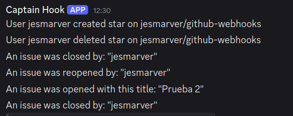

# Node.js Webhooks

Este es un proyecto de prueba en el que se integran webhooks de github y discord.

## Configuración y ejecución del proyecto
1. Clonar el archivo .env.template y renombrarlo a .env, cambiar la variable DISCORD_WEBHOOK_URL con la url creada desde discord y establecer el SECRET_TOKEN (se recomienda generar el token con el comando 
\
`ruby -rsecurerandom -e 'puts SecureRandom.hex(20)'`).

2. Instalar las dependencias con `npm i`.
3. Crear webhook en github
    - Dentro del proyecto -> Settings -> Webhooks -> Add webhook.
    - Se debe especificar la url de despliegue del proyecto (se puede hacer pruebas con la url que genera ngrok al exponer un puerto http) y el secret con el valor generado anteriormente para SECRET_TOKEN.
4. Ejecutar el proyecto con `npm run dev`

## Funcionamiento
Github lanzará peticiones al webhook especificado cada vez que:
- Un usuario marca el proyecto como favorito
- Un usuario desmarque el proyecto como favorito
- Se abre un issue
- Se cierra un issue
- Se reabre un issue

En cada caso, se intercepta la petición proveniente de github y se manda a discord un mensaje con la información del proceso como se ve en la captura

